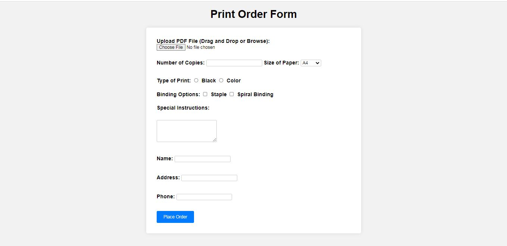

# Printing Order Website

## Description
This is a responsive and modern website for placing printing orders. Users can sign up, log in, and place orders through a user-friendly interface. The project is built using HTML, CSS, JavaScript, and PHP.

## Screenshot




## Features
- **User Authentication**: Users can sign up and log in to access the order placement functionalities.
- **Responsive Design**: The website is designed to be fully responsive and works seamlessly across various devices.
- **Order Placement**: Users can place printing orders through a simple and intuitive interface.

## Technologies Used
- **HTML**: For structuring the web pages.
- **CSS**: For styling the website and making it responsive.
- **JavaScript**: For adding interactivity to the web pages.
- **PHP**: For server-side scripting and handling user authentication and order placement.

## Installation
1. Clone the repository:
    ```bash
    git clone https://github.com/malhar-24/printing-order-website.git
    ```
2. Navigate to the project directory:
    ```bash
    cd printing-order-website
    ```
3. Set up a local server (e.g., XAMPP, WAMP) and place the project folder in the `htdocs` directory.
4. Import the database (if applicable) into your local server's database management system.
5. Open the website in your browser by navigating to `http://localhost/printing-order-website`.


